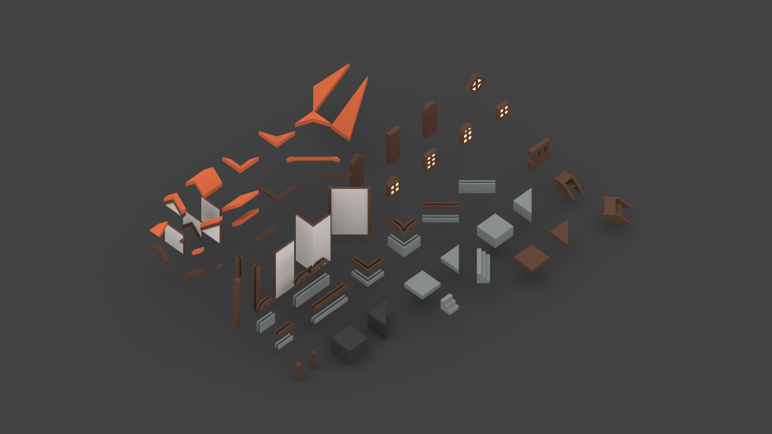
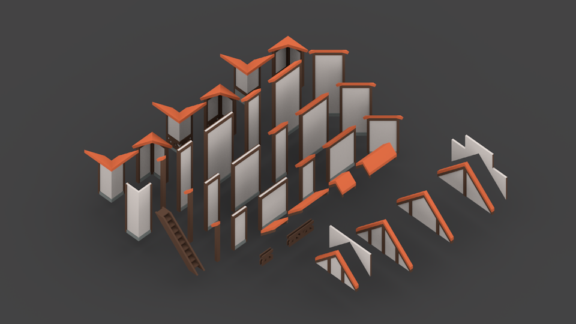
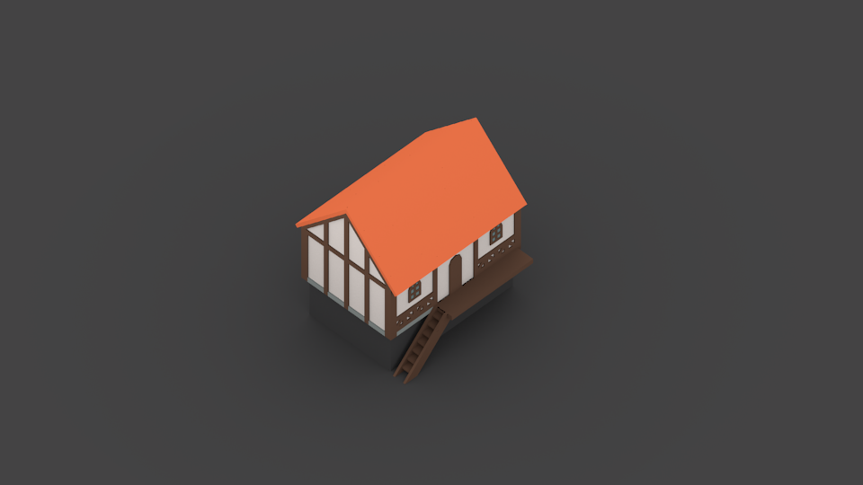
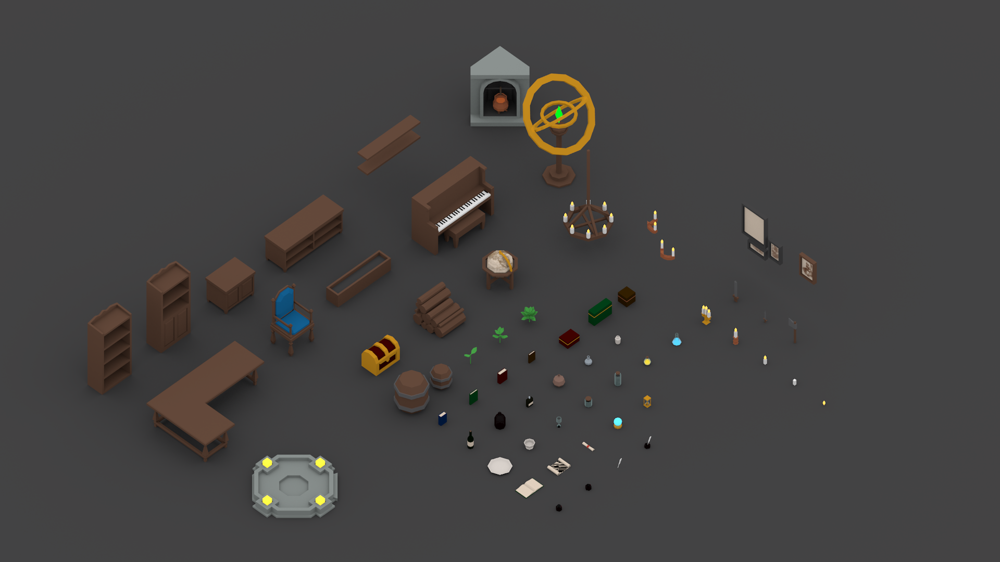
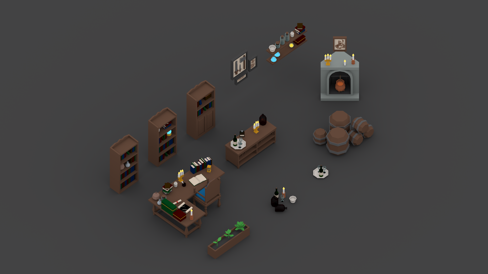
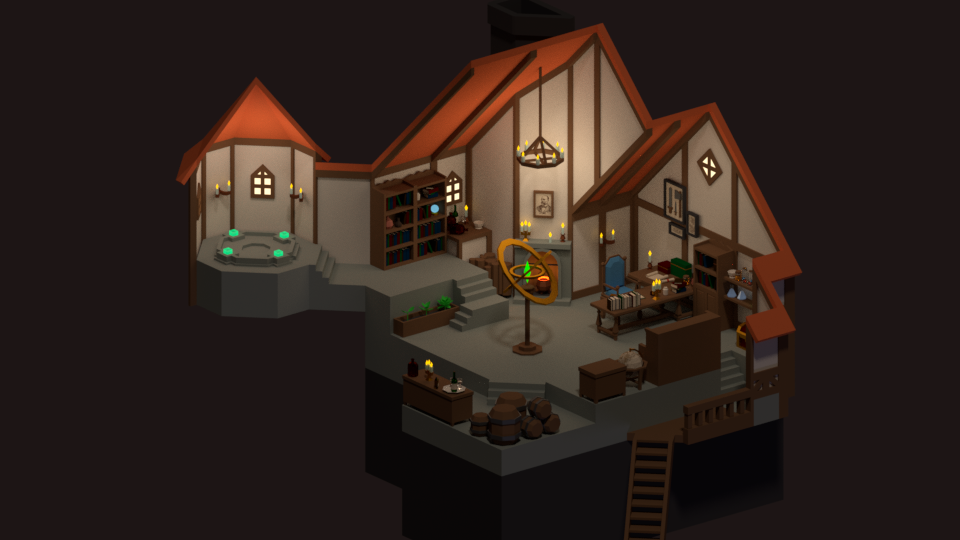

My attempt to create a modular medieval game asset pack to be used in Unity, Web VR, and other environments.

## Design Principles

* Modular: All assets share the same grid system and can work together.
* Atomic: Provide all assets from the very granular level to higher level groupings so its both flexible and easy to use.
* Performant: Support different level of details.
* Easy to assemble
* Easy to extend from

### Scale

1 unit = 1 meter

### Grid

While there isn't a strict grid system for all the tiny objects, larger objects like walls, furnitures, roofs snap to a 1x1 grid system, very much like Sims.

### Materials

Providing both BI rendering and Cycles rendering materials so it can be super easy to use or to be baked.

Each material file contains one swatch object that has all materials. Once linked, all materials will be available.

Materials are mostly named by what they are (e.g. Wood), not where they are used (e.g. PillarMaterial) for reusability.

## Objects

### Exterior

Adopting [atomic design principles](http://atomicdesign.bradfrost.com/) for exterior building blocks, so the same assets can be used to create infinite amount of different buildings.

#### 1. Atoms

Atoms are the most granular building blocks, like a piece of roof edge, a part of wall decor, etc. They do not contain or share smaller parts.

Atoms are used to assemble molecules and organisms, but they rarely appear just by themselves.

#### 2. Molecules (WIP)

Molecules are meaningful groups of atoms, and this is where those tiny pieces start to make sense. A typical molecule would be a wall, a roof, etc.

With the molecules, it should be easy to put together many different buildings and room layouts.

#### 3. Organisms (WIP)

Organisms are pre-made buildings and rooms. I will try to create a handful of these so it's easy to quickly put together a little town.

For now it's just one example to show the idea.

### Interior

For interior items, they don't really share many meshes across objects (like a book cover? a ribbon?), so atomic design doesn't make sense.

Instead, I decided to just provide individual items, and a layer of arbitrary groupings.

#### Individual Items

1. Furnitures
2. Wall Decors
3. Lights
4. Other Items

#### Item Groups

## Scenes

With both exterior objects and interior objects, it should be really easy to assemble medieval game scenes.

In addition to the shared models, a complicated scene can have its own unique items, too.

### The Great Sorcerer’s Room

And the first scene I created (also the reason to make this) is for the [Medieval Fantasy Contest](https://blog.sketchfab.com/real-time-design-challenge-medieval-fantasy/) at [SketchFab](https://sketchfab.com/), sponsored by [Mozilla](https://www.mozilla.org/en-US/).

#### Storyline 

You are captured by a great sorcerer in medieval's time by his newly invented magic portal. From his room, you can see he's a true master of all dark sorceries: potion brewing, magical plants, music, weaponry, spells, etc. 

Use your 21st century wisdom, search through the hidden clues in his room, and figure out how to restart the time-traveling portal before the sorcerer comes back!

Yes, I'm also planning to make a VR escape room game out of this as my capstone project for the [Udacity VR Nanodegree Program](https://www.udacity.com/course/vr-developer-nanodegree--nd017).

#### Rendered and Baked Scene

Check it out on SketchFab (with VR support, too): 
[https://sketchfab.com/models/4a26317612b14bef831b1b3305e20c1c](https://sketchfab.com/models/4a26317612b14bef831b1b3305e20c1c)

Also work in progress post if you are that interested:  
[https://forum.sketchfab.com/t/wip-the-great-sorcerers-room/16308](https://forum.sketchfab.com/t/wip-the-great-sorcerers-room/16308)

## References

* Atomic Design: [http://atomicdesign.bradfrost.com/](http://atomicdesign.bradfrost.com/)
* Udemy Learn 3D Modelling Course, Section 7 Game Asset Pack: [https://www.udemy.com/blendertutorial/](https://www.udemy.com/blendertutorial/)
* Wikimedia Commons
	* [https://commons.wikimedia.org/wiki/File:Bouchard_CIPB0325.jpg](https://commons.wikimedia.org/wiki/File:Bouchard_CIPB0325.jpg)
	* [https://commons.wikimedia.org/wiki/File:7-6-Les-souhaits.jpg](https://commons.wikimedia.org/wiki/File:7-6-Les-souhaits.jpg)
	* [https://commons.wikimedia.org/wiki/File:Avesta_kyrka_-_KMB_-_16001000523584.jpg](https://commons.wikimedia.org/wiki/File:Avesta_kyrka_-_KMB_-_16001000523584.jpg)
	* [https://commons.wikimedia.org/wiki/File:1798_Payne_Map_of_the_World_(pre_1800_American_Map)_-_Geographicus_-_World-payne-1798.jpg](https://commons.wikimedia.org/wiki/File:1798_Payne_Map_of_the_World_(pre_1800_American_Map)_-_Geographicus_-_World-payne-1798.jpg)

And special thanks to all the medieval work creators on [SketchFab](https://sketchfab.com), [ArtStation](https://www.artstation.com/), [Behance](https://www.behance.net/), and [everywhere else](https://www.pinterest.com/). My mood board literally overflows with greatness.

